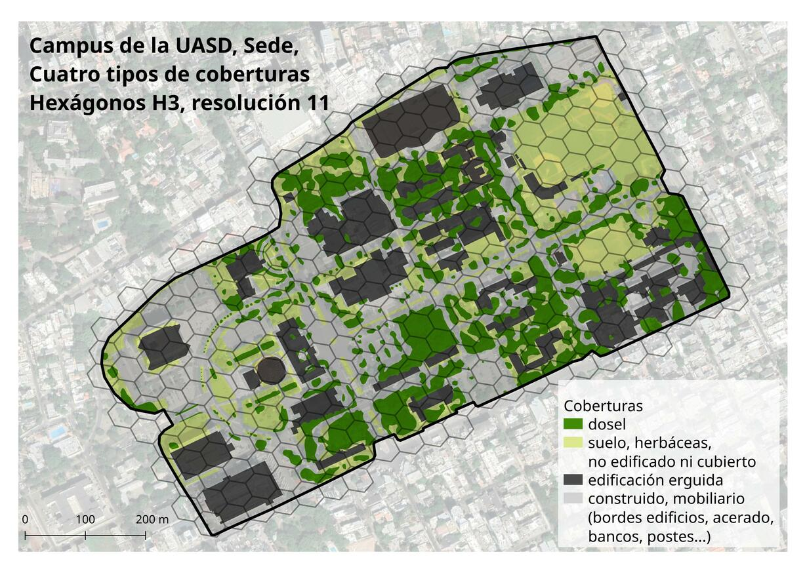

# Práctica 1. Mapa del campus de la UASD, Sede, cuatro tipos de coberturas, hexágonos H3, resolución 11

> Fecha de entrega: 15 de septiembre, 23:59 horas.

1. Observa el mapa a continuación:

**Figura 1**. Mapa síntesis del polígono núcleo del campus de la Universidad Autónoma de Santo Domingo (UASD) en su sede central. Superposición de  hexágonos H3 y coberturas del suelo (fuente: Martínez-Batlle, 2023).

2. Presta atención a los cuatro tipo de "coberturas". Si tienes dudas sobre alguno, hazme consulta. No hay mucho que documentarse sobre éstas coberturas, sólo que es importante que las puedas distinguir.

3. Presta atención a la malla, "cuadrícula" o índice de hexágonos H3. Documéntate [sobre ella](https://h3geo.org/), identifica qué es eso de las [resoluciones](https://h3geo.org/docs/core-library/restable), y qué significa "resolución 11".

4. Intenta determinar el área del Campus, al menos del polígono central. Puedes hacer una aproximación, recurrir a herramientas de SIG, consultar en la web (cuidado aquí, que suele haber errores), o abrir el archivo [poligono-uasd.kml](fuentes/practica-01/poligono-uasd.kml) desde Google Earth o QGIS.

5. Tan pronto hayas comprendido cada una de las partes, redacta, en dos párrafos, una descripción del mapa en cuestión. No te preocupes si omites detalles técnicos o si no conoces en detalle las coberturas. Céntrate en describir lo que ves en el mapa, los patrones espaciales que ves en relación con dichos elementos.

6. Formula tres preguntas de investigación que entiendas se pueden resolver con el diseño mostrado en el mapa, asumiendo que colectarías hormigas en una selección de cinco hexágonos de coberturas variadas. Las preguntas deben poner en asociación "hábitats" y comunidad de hormigas.

## Definamos los criterios de evaluación

Elegimos cinco criterios de evaluación. Los destacados en negrita son los elegidos.

1. **Claridad**:

   - ¿La redacción y las preguntas son claras y fáciles de entender?
   - ¿El propósito de la pregunta de investigación está bien definido?

2. **Relevancia**:

   - ¿Se relacionan las preguntas directamente con los elementos propios de los hábitats y las comunidades ecológicas?
   - ¿Es relevante para el campo de la biogeografía?

3. **Especificidad**:

   - ¿Las preguntas son específicas como para guiar una investigación detallada?
   - ¿Evita preguntas vagas o demasiado generales?

4. Contexto teórico:

   - ¿La pregunta demuestra un entendimiento claro del contexto teórico y científico en el que se encuentra la biogeografía/ecología?
   - ¿Hace referencia a teorías o conceptos pertinentes?

5. **Viabilidad y factibilidad**:

   - ¿Las preguntas son abordables y pueden ser investigadas dentro de un marco de tiempo y recursos razonables?
   - ¿Considera las limitaciones prácticas de la investigación?

6. Originalidad e innovación:

   - ¿Las preguntas muestran un enfoque original o una perspectiva novedosa hacia las comunidades ecológicas y, en general, a la biogeografía?
   - ¿Proponen nuevas ideas o enfoques?

7. **Métodos de observación**:

   - ¿Las preguntas sugieren métodos de observación apropiados para analizar comunidades ecológicas y/o hábitats en cuestión?
   - ¿Consideran la disponibilidad de datos y herramientas?

8. Potencial de contribución:

   - ¿Las preguntas tienen el potencial de contribuir al conocimiento actual en biogeografía/ecología?
   - ¿Pueden generar información útil para la comunidad científica?

9. Redacción y estructura:

   - ¿La pregunta está redactada de manera clara y coherente?
   - ¿Sigue una estructura lógica y gramaticalmente correcta?

10. Creatividad y originalidad:

    - ¿Las preguntas demuestran creatividad en la formulación y enfoque biogeográfico/ecológico?
    - ¿Presentan ideas novedosas o perspectivas únicas?

11. Impacto potencial:

    - ¿Se evidencia el potencial impacto de la investigación que se podría derivar de estas preguntas?
    - ¿Se pueden identificar posibles aplicaciones o implicaciones prácticas?

12. Conexión con objetivos personales o institucionales:
    - ¿Las preguntas de investigación se alinean con los objetivos personales o institucionales del investigador o del proyecto en curso?

## Usa esta escala de valoración

**Nivel 4 (Excelente)**:

- Se demuestra un profundo entendimiento del tema y del contexto teórico.
- La descripción realizada es excelente, y se explican de manera fluida la distribución y los patrones espaciales.
- Las preguntas son originales, claras, específicas, relevantes, y tienen potencial de contribución.

**Nivel 3 (Bueno)**:

- Se demuestra entendimiento del tema y algo del contexto teórico.
- La descripción realizada es legible, y se explican de forma aceptable la distribución y los patrones espaciales.
- Las preguntas son originales y específicas, pero les falta relevancia y potencial de contribución.

**Nivel 2 (Aceptable)**:

- Se demuestra algo de entendimiento del tema, y no se aporta contexto teórico.
- La descripción realizada no es fluida, y se explican de forma insuficiente la distribución y los patrones espaciales.
- Las preguntas no son originales ni específicas, y carecen de relevancia y potencial de contribución.

**Nivel 1 (En Desarrollo)**:

- No se demuestra entendimiento del tema, y no se aporta contexto teórico.
- En la descripción, sólo se explican detalles inconexos.
- Las preguntas presentadas son insuficientes.

## Solución aportada por el tali

> 5. Tan pronto hayas comprendido cada una de las partes, redacta, en dos párrafos, una descripción del mapa en cuestión. No te preocupes si omites detalles técnicos o si no conoces en detalle las coberturas. Céntrate en describir lo que ves en el mapa, los patrones espaciales que ves en relación con dichos elementos.

La figura 1 muestra el mapa del polígono núcleo del campus de la UASD en su sede central, localizado en la denominada Ciudad Universitaria, al sur del Distrito Nacional de Santo Domingo, capital de la República Dominicana (Martínez-Batlle, 2023). Tiene una extensión de 0.476 km2, y se encuentra a una elevación promedio de 15 metros sobre el nivel del mar. El polígono está limitado al norte por la calle José Contreras, al sur por la Correa y Cidrón, al este por la Santo Tomás de Aquino y al oeste por las calles José Dolores Alfonseca y Rafael Sánchez Ravelo.

Superpuesta al polígono núcleo, se incluye una capa vectorial conteniendo la porción intersectada del índice espacial de hexágonos H3, resolución 11 (Uber Technologies Inc., 2023). Este índice consiste en un sistema geoespacial de código abierto que utiliza celdas hexagonales para indexar el mundo, ofreciendo funciones para manipular y analizar dichas celdas. Los índices espaciales de celdas hexagonales tienen múltiples ventajas sobre los de celdas cuadradas y rectangulares, siendo las principales las siguientes: las distancias entre los centros son constantes, no se distorsiona la conectividad entre celdas y el efecto de borde es mínimo (una característica muy propia de los círculos) manteniéndose al mismo tiempo la vecindad topológica por contacto (los hexágonos vecinos comparten lados). Adicionalmente, el mapa incluye una capa vectorial de coberturas del suelo destacada en el mapa de síntesis, la cual contiene cuatro coberturas básicas, que son: dosel, suelo con herbáceas o sin ellas, edificación erguida y espacios con construcciones-mobiliario (bordes de edificios, acerado, accesos, etc.) (Martínez-Batlle, 2023). La cobertura predominante corresponde a los espacios construidos (pero no edificaciones erguidas), con más de 33%, mientras que las restantes ocupan ca. 22% cada una. En cuanto a la distribución espacial, la cobertura dosel arbóreo (incluye también dosel arbustivo) se distribuye en casi todo el campus, pero con una mayor concentración en el entorno de las facultades de Ciencias, de Artes y de Ingeniería y Arquitectura. La cobertura "suelo con herbáceas" se concentra al este, en el área de los *plays* y el campo de fútbol. Las áreas de edificaciones erguidas, así como los espacios con mobiliario y acerado, están repartidos por todo el campus.

> 6. Formula tres preguntas de investigación que entiendas se pueden resolver con el diseño mostrado en el mapa, asumiendo que colectarías hormigas en una selección de cinco hexágonos de coberturas variadas. Las preguntas deben poner en asociación "hábitats" y comunidad de hormigas.

Usando este mapa como fuente para el diseño de un estudio sobre hormigas, me planteo las siguientes preguntas de investigación:

- ¿La diversidad de hormigas es baja, en las áreas construidas o con edificaciones?
En esas mismas áreas, ¿la equidad es igualmente baja?

- ¿Existe asociación de algunas especies de hormigas con la cobertura dosel?

- Aunque quizá la información disponible en el mapa no es suficiente, pero me encantaría poder responder esta pregunta: en las áreas de acumulación de basura, ¿predominan especies ubicuas/cosmopolitas?

## Referencias

Martínez Batlle, JR. (2023). geofis/coberturas-suelo-uasd: Coberturas del suelo del polígono núcleo del campus de la Universidad Autónoma de Santo Domingo (UASD) en su sede central (v0.9). Zenodo. https://doi.org/10.5281/zenodo.8353988

Uber Technologies, Inc. (2023). H3. Sistema jerárquico de indexación geoespacial hexagonal. Recuperado desde https://h3geo.org/docs

