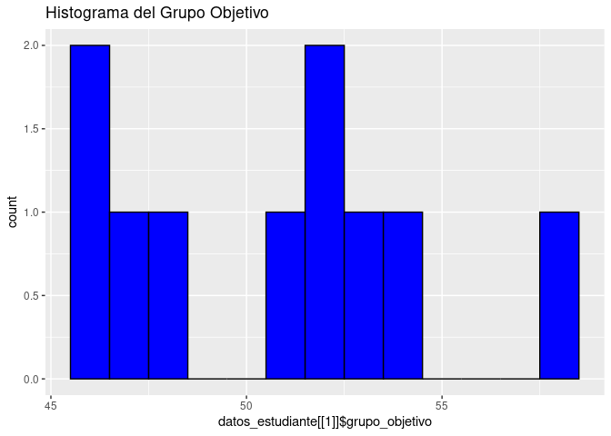
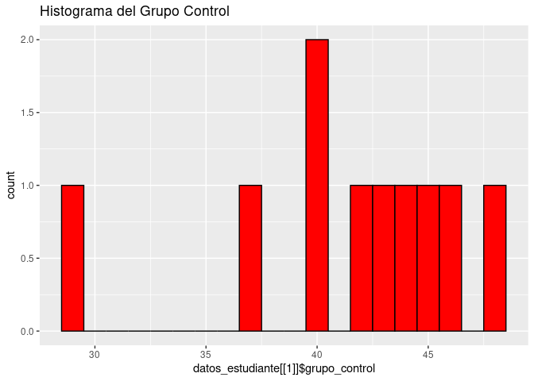

Práctica 1. Repaso de estadística
================

# Práctica 1. Repaso de estadística

## Objetivo

- Analizar una muestra con técnicas básicas de la estadística elemental.

- Documentar el trabajo.

``` r
# Establecer una semilla basada en el ID del estudiante para garantizar la unicidad
generar_datos <- function(id_estudiante) {
  set.seed(id_estudiante)

  # Grupo objetivo: distribución normal con una media más alta
  grupo_objetivo <- round(rnorm(10, mean = 50, sd = 5), 2)

  # Grupo control: distribución normal con una media más baja
  grupo_control <- round(rnorm(10, mean = 40, sd = 5), 2)

  return(data.frame(grupo_objetivo = grupo_objetivo, grupo_control = grupo_control))
}

# Ejemplo para un estudiante con ID específico (ejemplo: 1)
id_estudiante <- 1:30
datos_estudiante <- sapply(id_estudiante, function(x) generar_datos(x), simplify = F)
datos_estudiante
```

    ## [[1]]
    ##    grupo_objetivo grupo_control
    ## 1           46.87         47.56
    ## 2           50.92         41.95
    ## 3           45.82         36.89
    ## 4           57.98         28.93
    ## 5           51.65         45.62
    ## 6           45.90         39.78
    ## 7           52.44         39.92
    ## 8           53.69         44.72
    ## 9           52.88         44.11
    ## 10          48.47         42.97
    ## 
    ## [[2]]
    ##    grupo_objetivo grupo_control
    ## 1           45.52         42.09
    ## 2           50.92         44.91
    ## 3           57.94         38.04
    ## 4           44.35         34.80
    ## 5           49.60         48.91
    ## 6           50.66         28.44
    ## 7           53.54         44.39
    ## 8           48.80         40.18
    ## 9           59.92         45.06
    ## 10          49.31         42.16
    ## 
    ## [[3]]
    ##    grupo_objetivo grupo_control
    ## 1           45.19         36.28
    ## 2           48.54         34.34
    ## 3           51.29         36.42
    ## 4           44.24         41.26
    ## 5           50.98         40.76
    ## 6           50.15         38.46
    ## 7           50.43         35.23
    ## 8           55.58         36.76
    ## 9           43.91         46.12
    ## 10          56.34         41.00
    ## 
    ## [[4]]
    ##    grupo_objetivo grupo_control
    ## 1           51.08         42.83
    ## 2           47.29         40.08
    ## 3           54.46         41.92
    ## 4           52.98         39.77
    ## 5           58.18         40.17
    ## 6           53.45         40.85
    ## 7           43.59         45.83
    ## 8           48.93         39.78
    ## 9           59.48         39.50
    ## 10          58.88         38.58
    ## 
    ## [[5]]
    ##    grupo_objetivo grupo_control
    ## 1           45.80         46.14
    ## 2           56.92         35.99
    ## 3           43.72         34.60
    ## 4           50.35         39.21
    ## 5           58.56         34.64
    ## 6           46.99         39.31
    ## 7           47.64         37.01
    ## 8           46.82         29.08
    ## 9           48.57         41.20
    ## 10          50.69         38.70
    ## 
    ## [[6]]
    ##    grupo_objetivo grupo_control
    ## 1           51.35         48.64
    ## 2           46.85         34.11
    ## 3           54.34         43.27
    ## 4           58.64         38.16
    ## 5           50.12         37.00
    ## 6           51.84         40.27
    ## 7           43.45         48.54
    ## 8           53.69         34.53
    ## 9           50.22         38.55
    ## 10          44.76         51.04
    ## 
    ## [[7]]
    ##    grupo_objetivo grupo_control
    ## 1           61.44         41.78
    ## 2           44.02         53.58
    ## 3           46.53         51.41
    ## 4           47.94         41.62
    ## 5           45.15         49.48
    ## 6           45.26         42.34
    ## 7           53.74         35.53
    ## 8           49.42         38.46
    ## 9           50.76         39.98
    ## 10          60.95         44.94
    ## 
    ## [[8]]
    ##    grupo_objetivo grupo_control
    ## 1           49.58         36.20
    ## 2           54.20         41.46
    ## 3           47.68         42.11
    ## 4           47.25         33.53
    ## 5           53.68         40.35
    ## 6           49.46         35.93
    ## 7           49.15         47.55
    ## 8           44.56         38.64
    ## 9           34.94         47.79
    ## 10          47.03         38.81
    ## 
    ## [[9]]
    ##    grupo_objetivo grupo_control
    ## 1           46.17         46.39
    ## 2           45.92         37.66
    ## 3           49.29         40.36
    ## 4           48.61         38.67
    ## 5           52.18         49.23
    ## 6           44.07         35.80
    ## 7           55.96         39.61
    ## 8           49.91         26.91
    ## 9           48.76         44.44
    ## 10          48.19         36.46
    ## 
    ## [[10]]
    ##    grupo_objetivo grupo_control
    ## 1           50.09         45.51
    ## 2           49.08         43.78
    ## 3           43.14         38.81
    ## 4           47.00         44.94
    ## 5           51.47         43.71
    ## 6           51.95         40.45
    ## 7           43.96         35.23
    ## 8           48.18         39.02
    ## 9           41.87         44.63
    ## 10          48.72         42.41
    ## 
    ## [[11]]
    ##    grupo_objetivo grupo_control
    ## 1           47.04         35.86
    ## 2           50.13         38.26
    ## 3           42.42         32.31
    ## 4           43.19         38.72
    ## 5           55.89         34.25
    ## 6           45.33         40.06
    ## 7           56.62         38.89
    ## 8           53.12         44.44
    ## 9           49.77         37.04
    ## 10          44.98         36.72
    ## 
    ## [[12]]
    ##    grupo_objetivo grupo_control
    ## 1           42.60         36.11
    ## 2           57.89         33.53
    ## 3           45.22         36.10
    ## 4           45.40         40.06
    ## 5           40.01         39.24
    ## 6           48.64         36.48
    ## 7           48.42         45.94
    ## 8           46.86         41.70
    ## 9           49.47         42.53
    ## 10          52.14         38.53
    ## 
    ## [[13]]
    ##    grupo_objetivo grupo_control
    ## 1           52.77         34.53
    ## 2           48.60         42.31
    ## 3           58.88         33.20
    ## 4           50.94         30.72
    ## 5           55.71         37.80
    ## 6           52.08         39.03
    ## 7           56.15         46.98
    ## 8           51.18         40.50
    ## 9           48.17         39.43
    ## 10          55.53         43.51
    ## 
    ## [[14]]
    ##    grupo_objetivo grupo_control
    ## 1           46.69         38.09
    ## 2           58.59         41.50
    ## 3           60.61         43.37
    ## 4           57.49         38.54
    ## 5           49.82         42.44
    ## 6           56.16         44.41
    ## 7           49.68         49.31
    ## 8           55.34         48.06
    ## 9           48.12         40.68
    ## 10          55.22         45.44
    ## 
    ## [[15]]
    ##    grupo_objetivo grupo_control
    ## 1           51.29         44.28
    ## 2           59.16         38.18
    ## 3           48.30         40.83
    ## 4           54.49         33.79
    ## 5           52.44         47.30
    ## 6           43.72         39.98
    ## 7           50.11         39.90
    ## 8           55.45         40.16
    ## 9           49.34         34.16
    ## 10          44.62         37.40
    ## 
    ## [[16]]
    ##    grupo_objetivo grupo_control
    ## 1           52.38         49.24
    ## 2           49.37         40.56
    ## 3           55.48         36.27
    ## 4           42.78         48.29
    ## 5           55.74         43.61
    ## 6           47.66         31.68
    ## 7           44.97         42.88
    ## 8           50.32         42.36
    ## 9           55.12         37.29
    ## 10          52.87         45.64
    ## 
    ## [[17]]
    ##    grupo_objetivo grupo_control
    ## 1           44.92         45.90
    ## 2           49.60         43.22
    ## 3           48.84         46.48
    ## 4           45.91         40.94
    ## 5           53.86         47.96
    ## 6           49.17         39.72
    ## 7           54.86         44.19
    ## 8           58.58         40.80
    ## 9           51.28         43.13
    ## 10          51.83         43.17
    ## 
    ## [[18]]
    ##    grupo_objetivo grupo_control
    ## 1           54.63         30.58
    ## 2           59.11         44.56
    ## 3           41.95         33.47
    ## 4           48.57         40.21
    ## 5           48.29         36.07
    ## 6           51.83         46.06
    ## 7           43.36         35.38
    ## 8           62.06         36.61
    ## 9           50.32         46.66
    ## 10          57.73         42.31
    ## 
    ## [[19]]
    ##    grupo_objetivo grupo_control
    ## 1           44.05         42.59
    ## 2           51.94         44.42
    ## 3           48.28         42.95
    ## 4           47.26         39.02
    ## 5           54.90         43.30
    ## 6           48.82         38.70
    ## 7           54.05         37.14
    ## 8           46.28         47.03
    ## 9           48.70         42.52
    ## 10          49.08         36.50
    ## 
    ## [[20]]
    ##    grupo_objetivo grupo_control
    ## 1           55.81         39.90
    ## 2           47.07         39.25
    ## 3           58.93         36.86
    ## 4           43.34         46.62
    ## 5           47.77         32.39
    ## 6           52.85         37.81
    ## 7           35.55         44.85
    ## 8           45.65         40.14
    ## 9           47.69         39.57
    ## 10          47.22         41.95
    ## 
    ## [[21]]
    ##    grupo_objetivo grupo_control
    ## 1           53.97         28.62
    ## 2           52.61         43.79
    ## 3           58.73         37.26
    ## 4           43.64         40.86
    ## 5           60.99         42.81
    ## 6           52.17         47.56
    ## 7           42.15         43.30
    ## 8           45.33         45.61
    ## 9           50.32         36.08
    ## 10          49.99         37.87
    ## 
    ## [[22]]
    ##    grupo_objetivo grupo_control
    ## 1           47.44         36.18
    ## 2           62.43         40.41
    ## 3           55.04         43.72
    ## 4           51.46         39.58
    ## 5           48.96         36.04
    ## 6           59.29         35.39
    ## 7           49.67         44.31
    ## 8           49.19         50.01
    ## 9           49.00         44.68
    ## 10          51.50         31.92
    ## 
    ## [[23]]
    ##    grupo_objetivo grupo_control
    ## 1           50.97         41.09
    ## 2           47.83         34.77
    ## 3           54.57         38.56
    ## 4           58.97         42.41
    ## 5           54.98         33.92
    ## 6           55.54         41.54
    ## 7           48.61         37.40
    ## 8           55.10         37.79
    ## 9           50.23         37.00
    ## 10          57.88         46.47
    ## 
    ## [[24]]
    ##    grupo_objetivo grupo_control
    ## 1           47.27         33.42
    ## 2           52.68         42.99
    ## 3           52.10         36.19
    ## 4           47.08         32.85
    ## 5           54.24         41.66
    ## 6           51.33         37.65
    ## 7           52.22         38.33
    ## 8           47.67         47.68
    ## 9           45.76         43.05
    ## 10          50.01         42.58
    ## 
    ## [[25]]
    ##    grupo_objetivo grupo_control
    ## 1           48.94         31.29
    ## 2           44.79         33.38
    ## 3           44.23         37.26
    ## 4           51.61         32.72
    ## 5           42.50         40.41
    ## 6           47.77         44.64
    ## 7           58.67         36.42
    ## 8           52.56         44.81
    ## 9           50.50         47.73
    ## 10          49.71         34.95
    ## 
    ## [[26]]
    ##    grupo_objetivo grupo_control
    ## 1           39.35         48.05
    ## 2           55.74         39.90
    ## 3           47.55         37.09
    ## 4           54.13         51.91
    ## 5           47.95         40.81
    ## 6           50.74         45.04
    ## 7           50.64         40.14
    ## 8           54.58         34.48
    ## 9           49.80         31.34
    ## 10          52.10         43.95
    ## 
    ## [[27]]
    ##    grupo_objetivo grupo_control
    ## 1           59.54         33.57
    ## 2           55.72         40.17
    ## 3           46.18         47.85
    ## 4           42.71         40.79
    ## 5           44.53         36.27
    ## 6           51.48         34.66
    ## 7           50.03         31.86
    ## 8           55.79         34.66
    ## 9           60.67         39.87
    ## 10          51.19         41.60
    ## 
    ## [[28]]
    ##    grupo_objetivo grupo_control
    ## 1           40.49         36.72
    ## 2           49.68         47.60
    ## 3           43.34         40.27
    ## 4           40.90         36.21
    ## 5           50.81         30.71
    ## 6           52.66         45.40
    ## 7           51.48         46.78
    ## 8           50.10         37.82
    ## 9           48.44         40.71
    ## 10          59.21         41.92
    ## 
    ## [[29]]
    ##    grupo_objetivo grupo_control
    ## 1           43.58         42.14
    ## 2           43.68         49.62
    ## 3           51.07         41.55
    ## 4           54.73         39.84
    ## 5           44.12         42.36
    ## 6           60.55         38.29
    ## 7           47.39         32.79
    ## 8           45.35         39.90
    ## 9           52.10         47.08
    ## 10          55.56         37.77
    ## 
    ## [[30]]
    ##    grupo_objetivo grupo_control
    ## 1           43.56         34.88
    ## 2           48.26         30.90
    ## 3           47.39         36.66
    ## 4           56.37         39.70
    ## 5           59.12         44.40
    ## 6           42.44         41.34
    ## 7           50.55         39.90
    ## 8           46.20         37.38
    ## 9           46.65         32.95
    ## 10          51.37         30.83

## Calcula las medias de grupo control y grupo objetivo.

Las medias con R se calcularían de esta manera.

``` r
# Calculo de medias
media_grupo_objetivo <- mean(datos_estudiante[[1]]$grupo_objetivo)
media_grupo_objetivo
```

    ## [1] 50.662

``` r
media_grupo_control <- mean(datos_estudiante[[1]]$grupo_control)
media_grupo_objetivo
```

    ## [1] 50.662

``` r
# Calculo de la diferencia entre las medias
diferencia_medias <- media_grupo_objetivo - media_grupo_control
diferencia_medias
```

    ## [1] 9.417

Para hacer estos cálculos, usa <https://rdrr.io/snippets/>,
transcribiendo tus datos allí.

## Crea histogramas de grupo objetivo y grupo control.

Para la creación de histogramas, usa <https://rdrr.io/snippets/>,
transcribiendo tus datos allí. Una guía básica para la creación de un
histograma en R es la siguiente:

``` r
library(ggplot2)

# Crear histograma para el grupo objetivo
ggplot(data.frame(datos_estudiante[[1]]$grupo_objetivo), aes(x = datos_estudiante[[1]]$grupo_objetivo)) +
  geom_histogram(binwidth = 1, fill = "blue", color = "black") +
  ggtitle("Histograma del Grupo Objetivo")
```

<!-- -->

``` r
# Crear histograma para el grupo control
ggplot(data.frame(datos_estudiante[[1]]$grupo_control), aes(x = datos_estudiante[[1]]$grupo_control)) +
  geom_histogram(binwidth = 1, fill = "red", color = "black") +
  ggtitle("Histograma del Grupo Control")
```

<!-- -->

## Documenta el trabajo

- Redacta, en un párrafo, cómo se obtuvo la muestra, cómo se realizaron
  los cálculos y cómo construyeron los histogramas.

- Describe los resultados obtenidos en un párrafo. Puedes adjuntar tus
  histogramas.

Envía todo por correo electrónico a jmartinez19@uasd.edu.do
