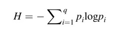
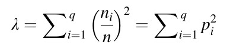

# Práctica 2. Dos (vapuleados) índices de diversidad

## Objetivo 

- Analizar la diversidad de forma muy elemental.

- Documentar el trabajo.

## Datos disponibles

```{r}
# Generar datos para la comunidad con abundancias desiguales
id_estudiante <- 1:30
generar_mc <- function(id_estudiante) {
  nombres_especies <- paste("Sp", 1:10)
  id_estudiante_p1 <- id_estudiante + 1
  abundancia_desigual <- c(
    rep(id_estudiante_p1, 2),
    rep(id_estudiante_p1^3, 4),
    rep(id_estudiante_p1^2, 3),
    rep(id_estudiante_p1^4, 1))
  abundancia_desigual <- ifelse(abundancia_desigual>1000, abundancia_desigual%%1000, abundancia_desigual)
  abundancia_homogenea <- rep(id_estudiante, 10)
  mc <- as.data.frame(x = matrix(data = c(abundancia_desigual, abundancia_homogenea), byrow = T,
                                 ncol = length(nombres_especies)))
  colnames(mc) <- nombres_especies
  return(mc)
}
lista_datos <- lapply(id_estudiante, function(x) generar_mc(x))
names(lista_datos) <- paste0('Estudiante número: ', 1:30)
lista_datos
```

## Mandatos para la asignación

1. **Análisis de la Comunidad Desigual:**
   - Calcula el índice de diversidad de Shannon para la comunidad con abundancias desiguales.
   - Calcula el índice de equidad de Simpson (Gini-Simpson) para esta comunidad.

2. **Análisis de la Comunidad Homogénea:**
   - Realiza los mismos cálculos para la comunidad con abundancias homogéneas.

3. **Comparación y Discusión:**
   - Compara los valores obtenidos para ambas comunidades.
   - Discute por qué los índices son diferentes y qué implica esto sobre la diversidad y equidad en cada comunidad.

4. **Envía todo por correo electrónico a jmartinez19\@uasd.edu.do**, antes de las 11:55 pm del 13 de febrero de 2024.


## Una ayudita

El índice de Shannon tiene la siguiente fórmula.



Asumamos que un sitio de muestreo es una variable cualitativa, y cada especie es un "estado". Bajo esta lógica, la dispersión de esta variable se calcula usando las frecuencias relativas *p<sub>i</sub>* de los *q*-estados usando la conocida **entropía de Shannon** o *H* (1948):

Desde el punto de vista ecológico, la **H** tiene dos propiedades importantes:

- Crece al aumentar la riqueza de especies *q*.
- Crece con la uniformidad (=equidad o equitabilidad, es decir, qué tan bien repartida se encuentra la abundancia entre las especies).

Un ejemplo ilustra lo anterior:

- Cinco especies, 55 individuos, abundancias desiguales:

```{r}
library(vegan)
foo1 <- c(25, 16, 9, 4, 1)
diversity(foo1)
```

- Cinco especies, 55 individuos, abundancias homogéneas

```{r}
foo2 <- c(11, 11, 11, 11, 11)
diversity(foo2)
log(5)
```

Otros índices miden exclusivamente la homogeneidad de la abundancia, a lo que se denomina equidad. Se trata de una de las componentes de la diversidad, y existen muchos índices "en el mercado" para medirla. Una medida común en trabajos de ecología numérica, pero que es inversa o contraria a la equidad, es el denominado **índice de concentración de Simpson** (1949), representado por *λ*, que equivale a la probabilidad de que dos individuos elegidos al azar pertenezcan a la misma especie.



Este valor aumenta con la dominancia, por lo que realmente no mide diversidad, sino más bien inequidad o concentración. Para transformarlo en un índice de diversidad, se utiliza el índice de Gini-Simpson *D=1-λ*, o el inverso de Simpson *D=1/λ*. **Este último es menos sensible a cambios de la abundancia en las especies muy comunes**. En R, puedes hacer estos cálculos de esta manera:


```{r}
diversity(foo1, index = 'simpson')
diversity(foo2, index = 'simpson')
```


## Rúbrica en formato Markdown

| Criterios                             | Nivel 1 (En desarrollo) | Nivel 2 (Aceptable) | Nivel 3 (Bueno) | Nivel 4 (Excelente) |
|---------------------------------------|-------------------------|---------------------|-----------------|---------------------|
| Cálculo de índices de diversidad      | Cálculos incorrectos o incompletos | Cálculos correctos, pero con pequeños errores | Cálculos correctos y bien presentados | Cálculos correctos, bien presentados y con excelente claridad |
| Interpretación y análisis             | Interpretación pobre o inexistente | Interpretación básica con algunos errores | Buena interpretación con análisis relevante | Interpretación profunda y análisis exhaustivo |
| Comparación de comunidades            | Comparación superficial o incorrecta | Comparación adecuada, pero falta profundidad | Comparación detallada y relevante | Comparación exhaustiva y con insights profundos |
| Calidad y claridad de la presentación | Presentación desorganizada y difícil de seguir | Presentación clara con algunos errores menores | Presentación bien estructurada y clara | Presentación excepcionalmente clara, bien estructurada y profesional |


