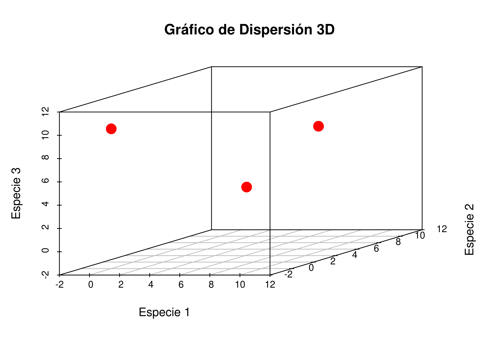

Practica 2. Métricas básicas de ecología numérica, reproducibilidad,
redacción, estilos de formato, tablas, citas y referencias
================
<b>José-Ramón Martínez-Batlle</b> (<jmartinez19@uasd.edu.do>) <br>
Facultad de Ciencias, Universidad Autónoma de Santo Domingo (UASD) <br>
Santo Domingo, República Dominicana

<!-- README.md se genera a partir de README.Rmd. Por favor, edita ese archivo. -->

> Fecha de entrega: ¡PLAZO EXTENDIDO! 1 de octubre, 23:59 horas.

> **ACTUALIZACIÓN. Entrega tu práctica en archivo(s) en formato nativo
> (editable) del programa que hayas usado y, opcionalmente, en formato
> PDF. Por ejemplo, si trabajaste tu documento en Microsoft Word, envía
> el correspondiente archivo .docx o .doc. Si lo hiciste en LibreOffice
> Writer, envía el archivo .odt o el que corresponda, pero que sea
> nativo y editable. Si trabajaste en LaTeX, envía el archivo .tex y los
> asociados a éste.**

Comenzarás tu manuscrito con la asignación de la próxima semana, y con
esta práctica vas a “calentar motores”. Tanto el fondo como la forma de
dicho ensayo son importantes. En cuanto al fondo, es decir, el tema y su
desarrollo, tratará **sobre hormigas del polígono núcleo del campus de
la Universidad Autónoma de Santo Domingo (UASD) en su sede central**. El
objetivo de esta práctica es que ensayes los aspectos básicos de la
redacción científica.

Esta práctica se basa en un sencillo conjunto de datos, te ayudará a
ensayar para que tu manuscrito—el cual comenzarás la próxima semana,
reitero—quede como una investigación reproducible, bien redactada y bien
presentada, es decir, que quede como un documento que cumpla con los
requisitos de disponibilidad de datos fuente y protocolo de análisis,
así como con estilos de formato, uso apropiado de figuras, tablas, citas
y referencias. Dividí la práctica en dos partes. En la primera parte, te
ofrezco un ejercicio simple y ficticio de ecología numérica, que te
servirá de excusa para mejorar tus habilidades analíticas y presentar
resultados con nivel científico, antes de que comiences a colectar datos
de campo y redactar formalmente tú manuscrito. En la segunda parte, te
pido que formules las preguntas que responderás en tu manuscrito real de
hormigas. Vamos allá.

> En tutorías, estoy dispuesto a introducirles al uso de LaTeX, Overleaf
> o RStudio para la redacción científica. Conversa con tus compañeros y
> compañeras, elijan un día entre miércoles y viernes, en horario de 9 a
> 12. El día fijado, les hago demostraciones en vivo sobre cómo redactar
> artículos usando dichas herramientas.

## Parte 1. Calcular métricas básicas de ecología numérica: distancia, diversidad y concentración

1.  Ve a [rdrr.io](https://rdrr.io/snippets/) y, con el pequeño *script*
    que verás abajo, genera una “matriz de comunidad” ficticia. Pregunta
    a tu tutor de inteligencia artificial (IA) de preferencia “¿Qué es
    una matriz de comunidad en R en el contexto del paquete `vegan`?”.

``` r
vector_abundancias <- c(
  sample(c(rpois(3, sample(x = 5:8, size = 1)), rep(0, 3))),
  rep(sample(5:8, 1), 3))
vector_abundancias <- ifelse(vector_abundancias > 10, 10, vector_abundancias)
mc <- data.frame(matrix(#Estas líneas generan la matriz de comunidad
  data = vector_abundancias,
  nrow=3, ncol=3, byrow = T))
mc[which(rowSums(mc)==0), ] <- c(0, 0, sample(5:8, 1))
nombres_columnas <- paste('especie', 1:3)
colnames(mc) <- nombres_columnas
nombres_filas <- paste('sitio', 1:3)
rownames(mc) <- nombres_filas
mc #Imprime la matriz de comunidad
```

Este es un ejemplo de matriz de comunidad, pero recuerda usar la tuya
propia obtenida al ejecutar el código en
[rdrr.io](https://rdrr.io/snippets/).

<table class="table table-hover table-condensed" style="margin-left: auto; margin-right: auto;">
<caption>
</caption>
<thead>
<tr>
<th style="text-align:left;">
</th>
<th style="text-align:right;">
especie 1
</th>
<th style="text-align:right;">
especie 2
</th>
<th style="text-align:right;">
especie 3
</th>
</tr>
</thead>
<tbody>
<tr>
<td style="text-align:left;font-weight: bold;">
sitio 1
</td>
<td style="text-align:right;">
0
</td>
<td style="text-align:right;">
0
</td>
<td style="text-align:right;">
10
</td>
</tr>
<tr>
<td style="text-align:left;font-weight: bold;">
sitio 2
</td>
<td style="text-align:right;">
9
</td>
<td style="text-align:right;">
0
</td>
<td style="text-align:right;">
5
</td>
</tr>
<tr>
<td style="text-align:left;font-weight: bold;">
sitio 3
</td>
<td style="text-align:right;">
8
</td>
<td style="text-align:right;">
8
</td>
<td style="text-align:right;">
8
</td>
</tr>
</tbody>
</table>

> La matriz generada será diferente con cada corrida. Por esta razón,
> IMPORTANTE: ¡captura la pantalla tras ejecutar el código o copia la
> matriz a una hoja de cálculo! (pregunta a un tutor de IA cómo
> hacerlo). Normalmente, para hacer que una selección aleatoria de
> números sea reproducible, se usa la función `set.seed()`, pero no
> quiero hacer el ejercicio muy largo, y no entraré en detalles. Si
> quieres investigar al respecto, pregunta a tu tutor en qué ayuda usar
> `set.seed()`.

Así se verían, en un espacio tridimensional, la localización de los
sitios en función de la abundancia de cada una de las especies.



2.  Con la matriz que obtengas, calcula la “distancia euclidiana entre
    sitios”. No veas “distancia” como la separación espacial sobre un
    mapa, sino más bien como la separación entre sitios en un espacio
    definido por la composición de especies. Un ejemplo en clase te
    ayudará a verlo mejor. Si tienes problemas para comprenderlo, pídele
    a tu tutor de IA que te lo explique.

Dado que tienes tres sitios, el número de distancias únicas a calcular
será tres: la distancia entre `sitio 1` y `sitio 2`, la distancia entre
`sitio 1` y `sitio 3`, y la distancia entre `sitio 2` y `sitio 3`. Sin
embargo, una matriz de distancias entre tres sitios tiene nueve celdas
rellenables, tres de las cuales son las ya mencionadas, otras tres son
repeticiones de las anteriores (asumiendo que desde sitio 1 hasta sitio
2 hay la misma distancia que desde sitio 2 hasta sitio 1), y otras tres
que valen cero (se denomina “diagonal”, y contiene las distancias entre
los sitios y ellos mismos, respectivamente). Deberás emplear la
siguiente fórmula para calcular una distancia entre sitios:

^2 + (y_i - y_j)^2 + (z_i - z_j)^2}")

Donde:


es la distancia euclidiana entre los puntos

y
.

")
son las coordenadas del punto
,
es decir, los valores de abundancia de cada especie en el sitio
.

")
son las coordenadas del punto
,
es decir, los valores de abundancia de cada especie en el sitio
.

3.  Rellena la matriz de distancias. Esta tendrá la forma siguiente:

<table class="table table-hover table-condensed" style="margin-left: auto; margin-right: auto;">
<caption>
</caption>
<thead>
<tr>
<th style="text-align:left;">
</th>
<th style="text-align:left;">
sitio 1
</th>
<th style="text-align:left;">
sitio 2
</th>
<th style="text-align:left;">
sitio 3
</th>
</tr>
</thead>
<tbody>
<tr>
<td style="text-align:left;font-weight: bold;">
sitio 1
</td>
<td style="text-align:left;">
Distancia de sitio 1 a sitio 1
</td>
<td style="text-align:left;">
Distancia de sitio 2 a sitio 1
</td>
<td style="text-align:left;">
Distancia de sitio 3 a sitio 1
</td>
</tr>
<tr>
<td style="text-align:left;font-weight: bold;">
sitio 2
</td>
<td style="text-align:left;">
Distancia de sitio 1 a sitio 2
</td>
<td style="text-align:left;">
Distancia de sitio 2 a sitio 2
</td>
<td style="text-align:left;">
Distancia de sitio 3 a sitio 2
</td>
</tr>
<tr>
<td style="text-align:left;font-weight: bold;">
sitio 3
</td>
<td style="text-align:left;">
Distancia de sitio 1 a sitio 3
</td>
<td style="text-align:left;">
Distancia de sitio 2 a sitio 3
</td>
<td style="text-align:left;">
Distancia de sitio 3 a sitio 3
</td>
</tr>
</tbody>
</table>

Este es un ejemplo real de una matriz de distancias (nota las
repeticiones y los ceros):

<table class="table table-hover table-condensed" style="margin-left: auto; margin-right: auto;">
<caption>
</caption>
<thead>
<tr>
<th style="text-align:left;">
</th>
<th style="text-align:right;">
sitio 1
</th>
<th style="text-align:right;">
sitio 2
</th>
<th style="text-align:right;">
sitio 3
</th>
</tr>
</thead>
<tbody>
<tr>
<td style="text-align:left;font-weight: bold;">
sitio 1
</td>
<td style="text-align:right;">
0.0
</td>
<td style="text-align:right;">
10.3
</td>
<td style="text-align:right;">
11.5
</td>
</tr>
<tr>
<td style="text-align:left;font-weight: bold;">
sitio 2
</td>
<td style="text-align:right;">
10.3
</td>
<td style="text-align:right;">
0.0
</td>
<td style="text-align:right;">
8.6
</td>
</tr>
<tr>
<td style="text-align:left;font-weight: bold;">
sitio 3
</td>
<td style="text-align:right;">
11.5
</td>
<td style="text-align:right;">
8.6
</td>
<td style="text-align:right;">
0.0
</td>
</tr>
</tbody>
</table>

Usa todos los apoyos que necesites. Por ejemplo, puedes usar una hoja
milimetrada (si la sabes usar), una simple calculadora (la del celular o
una de mano), hojas de cálculo, y hasta IA si lo deseas. Si usas IA, no
le pidas que te resuelva el ejercicio pasándole el mandato tal cual y
luego copiando-pegando. Más bien, pídele que te explique cómo resolverlo
y hazlo por tu cuenta (este es el verdadero modo tutor). Cuando obtengas
tu matriz de distancias, pídele al tutor de IA que también la calcule,
para confirmar que tu resultado está correcto.

Todo el rollo anterior no servirá para nada si no haces esto último:
observa tu resultado y analízalo. Respóndete estas preguntas: ¿qué par
de sitios están más distintes? ¿por qué? ¿qué par de sitios están más
próximos? ¿por qué?

4.  Calcula el índice de diversidad de Shannon y el de concentración de
    Simpson. Utiliza las siguientes fórmulas para calcular los
    correspondientes índices:

-   Índice de Shannon
    
    (Borcard et al., 2018):

")

Donde:


es el índice de diversidad de Shannon.


es el número total de especies.


representa la proporción de individuos que pertenecen a la especie
.


es el logaritmo natural.

Esta fórmula se utiliza para medir la diversidad de especies en un
ecosistema o comunidad, teniendo en cuenta la riqueza de especies y su
abundancia relativa.

-   Índice de concentración de Simpson
    ()
    (Borcard et al., 2018):

^2 = \sum_{i=1}^{S} (p_i)^2")

Donde:

es el índice de concentración de Simpson.


es el número total de especies.


es el número de individuos (abundancia) de la especie
.


es el número total de individuos (abundancia total)


representa la proporción de individuos que pertenecen a la especie
.

El índice de concentración de Simpson se utiliza para medir la
concentración o dominancia de especies en una comunidad. Un valor más
alto de

indica una mayor concentración de abundancia en unas pocas especies,
mientras que un valor más bajo sugiere una distribución más equitativa
de la abundancia entre especies. Quizá conoces más el índice de equidad
de Simpson, dado por

que, al contrario que el anterior, mide la distribución equitativa y es
más alto cuando hay mejor repartición de la abundancia.

Al igual que en el punto anterior, todo el rollo que te he contado
anterior no servirá para nada si no haces esto último: observa los
índices calculados y analízalos. Respóndete estas preguntas: ¿por qué
diversidad y concentración varían en los distintos sitios?

> Es importante notar que, para ambos índices, se han descubierto
> limitaciones en ecología numérica, por lo que en los últimos años se
> están prefiriendo otras alternativas. Más detalles en Martínez Batlle
> (2020).

5.  Redacta un documento sobre este ejercicio, un miniensayo. Si haces
    tu documento en Word, deberás usar estilos de formato (“Título 1”,
    “Normal”, etc.). En este ensayo, no está permitido usar relaciones
    de elementos (por ejemplo, listas de viñetas o listas numeradas).

> **RECUADRO: recomendaciones básicas de redacción**
>
> Usa una voz (activa o pasiva) de forma consistente, pero sólo ten
> presente que, en la redacción de manuscritos científicos, a menudo se
> utilizan ambas voces, dependiendo del contexto y el mensaje que el/la
> autor/a quiera transmitir. Veamos algunos ejemplos:
>
> **Voz activa en manuscrito científicos:**
>
> -   **Analicé** los datos utilizando el software R.
>
> -   El experimento **mostró** que la temperatura afecta directamente
>     la tasa de reacción.
>
> -   Los investigadores **encontraron** una correlación significativa
>     entre las dos variables.
>
> La voz activa puede hacer que la redacción parezca más directa y
> clara, y es especialmente útil cuando el/la autor/a quiere enfatizar
> quién llevó a cabo una acción o cuándo se desea hacer una afirmación
> fuerte. Es la voz preferida en la redacción de artículos en inglés.
>
> **Voz pasiva en artículos científicos:**
>
> -   Los datos **fueron analizados** utilizando el software R.
>
> -   **Se observó** que la temperatura afecta directamente la tasa de
>     reacción.
>
> -   Una correlación significativa **fue encontrada** entre las dos
>     variables.
>
> La voz pasiva es común en la redacción científica en español,
> especialmente en Latinoamérica, porque a menudo se prefiere un tono
> más impersonal, enfocando la atención en los resultados y
> procedimientos en lugar de en quienes llevaron a cabo la
> investigación. También puede ser útil cuando no se quiere o no es
> relevante especificar quién realizó la acción.
>
> **En todas mis prácticas, está completamente permitido usar IA
> (e.g. chatGPT), pero te recomiendo que la uses más como tutor que como
> redactor**. Tal como te sugerí arriba, no le pidas que te resuelva los
> problemas del mandato. Pídele que te dé ideas, y que luego tú las
> mejores o las descartes. No abuses tampoco del texto, pues mucha
> redacción no siempre es mejor; en redacción de ensayos “menos es más”.
> Cruza las redacciones que te ofrezca con tu conocimiento, y revisa si
> los términos o conceptos usados son descabellados (toda IA se inventa
> cosas, cuidate de no caer en esa trampa). Nunca le pidas referencias
> bibliográficas, porque se va equivocar.

Distribuye tu texto en las siguientes cinco secciones:

-   **Introducción** (tamaño recomendado: 3 párrafos). Desde lo amplio,
    comienza escribiendo sobre ecología numérica (qué es). A
    continuación, explica qué son o qué representan las métricas que has
    calculado (distancia euclidiana, diversidad y concentración) en
    ecología numérica, resume su importancia, por qué es necesario
    calcularlas y para qué se usan. Plantea tu o tus objetivos, que en
    este caso son sencillos. Cierra con la importancia del cálculo de
    esta métricas respecto del conjunto de la ciencia.

    Dentro de esta sección, debes incluir al menos tres citas. Los
    conceptos y afirmaciones ajenas, deben citarse bibliográficamente, y
    nunca deberás usar cita literal, pues se considera plagio. Las citas
    bibliográficas que incluyas, deberán estar respaldadas por sus
    correspondientes cuyas referencias, que deberán aparecer en la
    sección final (Referencias). Las citas y la lista de referencias,
    deberán seguir el estándar APA 7ma edición (APA7). Es casi
    imprescindible que uses un gestor de citas y referencias, como
    Zotero.

-   **Materiales y métodos** (tamaño recomendado: 2 párrafos). Explica
    cómo obtuviste los datos que usaste, y describe brevemente las
    métricas que usaste (distancia euclidiana, índice de diversidad de
    Shannon, índice de concentración de Simpson). Dentro de la
    redacción, debes incluir al menos dos citas. También deberás incluir
    la matriz de comunidad en forma de tabla, y la o las fórmulas
    empleadas (no adelantes resultados en este punto, es decir, no des
    el resultado de los índices, simplemente explica cómo los
    calculaste). La tabla (matriz de comunidad) debes referirla en el
    texto (“ver tabla X”), usando un sistema de referencia cruzada
    asistido por el procesador de texto que uses (pregunta a tu tutor de
    inteligencia artificial de preferencia cómo insertar títulos a
    tablas, y cómo referirlos en el texto; también pregúntale cómo
    insertar y referir fórmulas).

-   **Resultados** (tamaño recomendado: 1 párrafo). Aquí debes colocar
    el cálculo de los índices que obtuviste. No hagas valoraciones en
    esta sección, simplemente incluye los índices en una redacción de
    párrafo (no se deben colocar números a secas). Bonus: si incluyes
    una figura, y la refieres apropiadamente, habrá valoración extra en
    los criterios de valoración.

-   **Discusión** (tamaño recomendado: 2 párrafos). Abre la discusión
    indicando si alcanzaste tus objetivos. Describe por qué era
    importante alcanzarlos. Comenta sobre las limitacines, de cualquier
    tipo, ya sea las limitaciones de los datos, de la técnicas, de los
    objetivos de aprendizaje. Cierra indicando qué desafíos futuros
    quedan abiertos tras este trabajo.

-   **Referencias**. Las referencias que hayas citado arriba, las
    deberás incluir aquí en formato APA 7ma edición.

## Parte 2. **Para tu manuscrito**, elige una técnica de ecología numérica, redacta tus preguntas de investigación y justifica la elección

1.  Revisa demostraciones y aplicaciones de ecología numérica en Borcard
    et al. (2018), y también en el repositorio Martínez Batlle (2020).
    Usarás una técnica de ecología numérica (por ejemplo, acumulación de
    flujo, clasificación del relieve) para aplicarla a tus datos de
    hormigas que producirás en el campus de la UASD. Es una decisión
    importante, porque será éste el tema que desarrollarás en tu
    manuscrito, desde ahora hasta el finalizar el semestre. Guíate de
    las listas a continuación, y de las demostraciones que encontrarás
    en el libro y el repo citados, así como de las demostraciones de
    aula.

<!-- -->

1.  Análisis de agrupamiento:

-   Las celdas hexagonales muestreadas, ¿se organizan en grupos
    diferenciados según la composición de las especies de hormigas?

-   Si existe algún patrón, ¿es consistente con algún atributo de
    cobertura del suelo?

-   ¿Hay especies indicadoras o con preferencia por determinados
    atributos de cobertura del suelo?

2.  Técnicas de ordenación:

-   En un espacio bidimensional, ¿existen tendencias apreciables de
    ordenación de las especies de hormigas?

-   Si existen tendencias de ordenación, ¿se asocian éstas con atributos
    de cobertura del suelo?

3.  Análisis de diversidad + análisis de agrupamiento:

-   Según los análisis de estimación de riqueza, ¿está suficientemente
    representada la comunidad de hormigas del campus de la UASD?
    Consideremos como buena representación un 80% del total esperado.

-   ¿Es la riqueza esperada mayor o menor según en qué hábitats
    (caracterizado por cobertura del suelo) nos encontremos?

-   ¿Existe asociación de la diversidad alpha con la cobertura del
    suelo, es decir, es mayor o menor la diversidad alpha según en qué
    tipo de cobertura del suelo nos encontremos?

-   ¿Existe contribución local o por alguna especie a la diversidad
    beta?

2.  Elige la técnica, justifica la elección, escribe tus preguntas.

-   Tecnica de ecología numérica elegida:

-   Justificación (1 párrafo):

-   Preguntas de investigación:

## Criterios de evaluación y escala de valoración

| Criterio de Evaluación                               | Nivel 1 (en desarrollo)                              | Nivel 2 (aceptable)                                       | Nivel 3 (bueno)                                     | Nivel 4 (excelente)                                                                         |
|------------------------------------------------------|------------------------------------------------------|-----------------------------------------------------------|-----------------------------------------------------|---------------------------------------------------------------------------------------------|
| **Comprensión del ejercicio**                        | No comprende las instrucciones del ejercicio.        | Demuestra comprensión parcial del ejercicio.              | Demuestra clara comprensión del ejercicio.          | Demuestra completa y detallada comprensión del ejercicio.                                   |
| **Cálculo de métricas básicas de ecología numérica** | Realiza cálculos incorrectos o incompletos.          | Algunos cálculos son correctos.                           | La mayoría de los cálculos son correctos.           | Todos los cálculos son correctos y justificados.                                            |
| **Redacción y estructura del ensayo**                | La estructura y redacción son confusas.              | La estructura es clara, pero con errores en la redacción. | La redacción es coherente y la estructura es clara. | La redacción es impecable y la estructura es coherente y lógica.                            |
| **Uso de estilos de formato y tablas**               | No usa estilos ni tablas adecuadamente.              | Usa estilos y tablas de forma básica.                     | Usa estilos y tablas adecuadamente.                 | Usa estilos y tablas de forma avanzada y coherente.                                         |
| **Inclusión y formato de citas y referencias**       | Omite citas o las usa incorrectamente.               | Usa algunas citas, pero con errores de formato.           | Usa citas correctamente con mínimos errores.        | Usa citas y referencias perfectamente, siguiendo APA7.                                      |
| **Análisis y discusión de resultados**               | No discute o analiza resultados.                     | Analiza resultados de forma superficial.                  | Discute y analiza resultados de forma detallada.    | Realiza un análisis crítico y detallado de los resultados, aportando insight significativo. |
| **Selección de técnica y justificación (Parte 2)**   | No selecciona o justifica adecuadamente una técnica. | Selecciona una técnica, pero la justificación es débil.   | Selecciona y justifica adecuadamente una técnica.   | Selecciona una técnica y ofrece una justificación profunda y coherente.                     |

## Referencias

<div id="refs" class="references csl-bib-body hanging-indent"
line-spacing="2">

<div id="ref-borcard2018numerical" class="csl-entry">

Borcard, D., Gillet, F. y Legendre, P. (2018). *Numerical ecology with
R*. Springer.

</div>

<div id="ref-jose_ramon_martinez_batlle_2020_4402362" class="csl-entry">

Martínez Batlle, J. R. (2020).
*biogeografia-master/scripts-de-analisis-BCI: Long coding sessions*
(Versión v0.0.0.9000) \[Computer software\]. Zenodo.
<https://doi.org/10.5281/zenodo.4402362>

</div>

</div>
