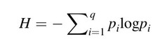

Práctica 2. Dos (vapuleados) índices de diversidad
================

# Práctica 2. Dos (vapuleados) índices de diversidad

## Objetivo

-   Analizar la diversidad de forma muy elemental.

-   Documentar el trabajo.

## Datos disponibles

``` r
# Generar datos para la comunidad con abundancias desiguales
id_estudiante <- 1:30
generar_mc <- function(id_estudiante) {
  nombres_especies <- paste("Especie", 1:10)
  id_estudiante_p1 <- id_estudiante + 1
  abundancia_desigual <- c(
    rep(id_estudiante_p1, 2),
    rep(id_estudiante_p1^3, 4),
    rep(id_estudiante_p1^2, 3),
    rep(id_estudiante_p1^4, 1))
  abundancia_desigual <- ifelse(abundancia_desigual>1000, abundancia_desigual%%1000, abundancia_desigual)
  abundancia_homogenea <- rep(id_estudiante, 10)
  mc <- as.data.frame(x = matrix(data = c(abundancia_desigual, abundancia_homogenea), byrow = T,
                                 ncol = length(nombres_especies)))
  colnames(mc) <- nombres_especies
  return(mc)
}
lista_datos <- lapply(id_estudiante, function(x) generar_mc(x))
names(lista_datos) <- paste0('Estudiante número: ', 1:30)
lista_datos
```

    ## $`Estudiante número: 1`
    ##   Especie 1 Especie 2 Especie 3 Especie 4 Especie 5 Especie 6 Especie 7
    ## 1         2         2         8         8         8         8         4
    ## 2         1         1         1         1         1         1         1
    ##   Especie 8 Especie 9 Especie 10
    ## 1         4         4         16
    ## 2         1         1          1
    ## 
    ## $`Estudiante número: 2`
    ##   Especie 1 Especie 2 Especie 3 Especie 4 Especie 5 Especie 6 Especie 7
    ## 1         3         3        27        27        27        27         9
    ## 2         2         2         2         2         2         2         2
    ##   Especie 8 Especie 9 Especie 10
    ## 1         9         9         81
    ## 2         2         2          2
    ## 
    ## $`Estudiante número: 3`
    ##   Especie 1 Especie 2 Especie 3 Especie 4 Especie 5 Especie 6 Especie 7
    ## 1         4         4        64        64        64        64        16
    ## 2         3         3         3         3         3         3         3
    ##   Especie 8 Especie 9 Especie 10
    ## 1        16        16        256
    ## 2         3         3          3
    ## 
    ## $`Estudiante número: 4`
    ##   Especie 1 Especie 2 Especie 3 Especie 4 Especie 5 Especie 6 Especie 7
    ## 1         5         5       125       125       125       125        25
    ## 2         4         4         4         4         4         4         4
    ##   Especie 8 Especie 9 Especie 10
    ## 1        25        25        625
    ## 2         4         4          4
    ## 
    ## $`Estudiante número: 5`
    ##   Especie 1 Especie 2 Especie 3 Especie 4 Especie 5 Especie 6 Especie 7
    ## 1         6         6       216       216       216       216        36
    ## 2         5         5         5         5         5         5         5
    ##   Especie 8 Especie 9 Especie 10
    ## 1        36        36        296
    ## 2         5         5          5
    ## 
    ## $`Estudiante número: 6`
    ##   Especie 1 Especie 2 Especie 3 Especie 4 Especie 5 Especie 6 Especie 7
    ## 1         7         7       343       343       343       343        49
    ## 2         6         6         6         6         6         6         6
    ##   Especie 8 Especie 9 Especie 10
    ## 1        49        49        401
    ## 2         6         6          6
    ## 
    ## $`Estudiante número: 7`
    ##   Especie 1 Especie 2 Especie 3 Especie 4 Especie 5 Especie 6 Especie 7
    ## 1         8         8       512       512       512       512        64
    ## 2         7         7         7         7         7         7         7
    ##   Especie 8 Especie 9 Especie 10
    ## 1        64        64         96
    ## 2         7         7          7
    ## 
    ## $`Estudiante número: 8`
    ##   Especie 1 Especie 2 Especie 3 Especie 4 Especie 5 Especie 6 Especie 7
    ## 1         9         9       729       729       729       729        81
    ## 2         8         8         8         8         8         8         8
    ##   Especie 8 Especie 9 Especie 10
    ## 1        81        81        561
    ## 2         8         8          8
    ## 
    ## $`Estudiante número: 9`
    ##   Especie 1 Especie 2 Especie 3 Especie 4 Especie 5 Especie 6 Especie 7
    ## 1        10        10      1000      1000      1000      1000       100
    ## 2         9         9         9         9         9         9         9
    ##   Especie 8 Especie 9 Especie 10
    ## 1       100       100          0
    ## 2         9         9          9
    ## 
    ## $`Estudiante número: 10`
    ##   Especie 1 Especie 2 Especie 3 Especie 4 Especie 5 Especie 6 Especie 7
    ## 1        11        11       331       331       331       331       121
    ## 2        10        10        10        10        10        10        10
    ##   Especie 8 Especie 9 Especie 10
    ## 1       121       121        641
    ## 2        10        10         10
    ## 
    ## $`Estudiante número: 11`
    ##   Especie 1 Especie 2 Especie 3 Especie 4 Especie 5 Especie 6 Especie 7
    ## 1        12        12       728       728       728       728       144
    ## 2        11        11        11        11        11        11        11
    ##   Especie 8 Especie 9 Especie 10
    ## 1       144       144        736
    ## 2        11        11         11
    ## 
    ## $`Estudiante número: 12`
    ##   Especie 1 Especie 2 Especie 3 Especie 4 Especie 5 Especie 6 Especie 7
    ## 1        13        13       197       197       197       197       169
    ## 2        12        12        12        12        12        12        12
    ##   Especie 8 Especie 9 Especie 10
    ## 1       169       169        561
    ## 2        12        12         12
    ## 
    ## $`Estudiante número: 13`
    ##   Especie 1 Especie 2 Especie 3 Especie 4 Especie 5 Especie 6 Especie 7
    ## 1        14        14       744       744       744       744       196
    ## 2        13        13        13        13        13        13        13
    ##   Especie 8 Especie 9 Especie 10
    ## 1       196       196        416
    ## 2        13        13         13
    ## 
    ## $`Estudiante número: 14`
    ##   Especie 1 Especie 2 Especie 3 Especie 4 Especie 5 Especie 6 Especie 7
    ## 1        15        15       375       375       375       375       225
    ## 2        14        14        14        14        14        14        14
    ##   Especie 8 Especie 9 Especie 10
    ## 1       225       225        625
    ## 2        14        14         14
    ## 
    ## $`Estudiante número: 15`
    ##   Especie 1 Especie 2 Especie 3 Especie 4 Especie 5 Especie 6 Especie 7
    ## 1        16        16        96        96        96        96       256
    ## 2        15        15        15        15        15        15        15
    ##   Especie 8 Especie 9 Especie 10
    ## 1       256       256        536
    ## 2        15        15         15
    ## 
    ## $`Estudiante número: 16`
    ##   Especie 1 Especie 2 Especie 3 Especie 4 Especie 5 Especie 6 Especie 7
    ## 1        17        17       913       913       913       913       289
    ## 2        16        16        16        16        16        16        16
    ##   Especie 8 Especie 9 Especie 10
    ## 1       289       289        521
    ## 2        16        16         16
    ## 
    ## $`Estudiante número: 17`
    ##   Especie 1 Especie 2 Especie 3 Especie 4 Especie 5 Especie 6 Especie 7
    ## 1        18        18       832       832       832       832       324
    ## 2        17        17        17        17        17        17        17
    ##   Especie 8 Especie 9 Especie 10
    ## 1       324       324        976
    ## 2        17        17         17
    ## 
    ## $`Estudiante número: 18`
    ##   Especie 1 Especie 2 Especie 3 Especie 4 Especie 5 Especie 6 Especie 7
    ## 1        19        19       859       859       859       859       361
    ## 2        18        18        18        18        18        18        18
    ##   Especie 8 Especie 9 Especie 10
    ## 1       361       361        321
    ## 2        18        18         18
    ## 
    ## $`Estudiante número: 19`
    ##   Especie 1 Especie 2 Especie 3 Especie 4 Especie 5 Especie 6 Especie 7
    ## 1        20        20         0         0         0         0       400
    ## 2        19        19        19        19        19        19        19
    ##   Especie 8 Especie 9 Especie 10
    ## 1       400       400          0
    ## 2        19        19         19
    ## 
    ## $`Estudiante número: 20`
    ##   Especie 1 Especie 2 Especie 3 Especie 4 Especie 5 Especie 6 Especie 7
    ## 1        21        21       261       261       261       261       441
    ## 2        20        20        20        20        20        20        20
    ##   Especie 8 Especie 9 Especie 10
    ## 1       441       441        481
    ## 2        20        20         20
    ## 
    ## $`Estudiante número: 21`
    ##   Especie 1 Especie 2 Especie 3 Especie 4 Especie 5 Especie 6 Especie 7
    ## 1        22        22       648       648       648       648       484
    ## 2        21        21        21        21        21        21        21
    ##   Especie 8 Especie 9 Especie 10
    ## 1       484       484        256
    ## 2        21        21         21
    ## 
    ## $`Estudiante número: 22`
    ##   Especie 1 Especie 2 Especie 3 Especie 4 Especie 5 Especie 6 Especie 7
    ## 1        23        23       167       167       167       167       529
    ## 2        22        22        22        22        22        22        22
    ##   Especie 8 Especie 9 Especie 10
    ## 1       529       529        841
    ## 2        22        22         22
    ## 
    ## $`Estudiante número: 23`
    ##   Especie 1 Especie 2 Especie 3 Especie 4 Especie 5 Especie 6 Especie 7
    ## 1        24        24       824       824       824       824       576
    ## 2        23        23        23        23        23        23        23
    ##   Especie 8 Especie 9 Especie 10
    ## 1       576       576        776
    ## 2        23        23         23
    ## 
    ## $`Estudiante número: 24`
    ##   Especie 1 Especie 2 Especie 3 Especie 4 Especie 5 Especie 6 Especie 7
    ## 1        25        25       625       625       625       625       625
    ## 2        24        24        24        24        24        24        24
    ##   Especie 8 Especie 9 Especie 10
    ## 1       625       625        625
    ## 2        24        24         24
    ## 
    ## $`Estudiante número: 25`
    ##   Especie 1 Especie 2 Especie 3 Especie 4 Especie 5 Especie 6 Especie 7
    ## 1        26        26       576       576       576       576       676
    ## 2        25        25        25        25        25        25        25
    ##   Especie 8 Especie 9 Especie 10
    ## 1       676       676        976
    ## 2        25        25         25
    ## 
    ## $`Estudiante número: 26`
    ##   Especie 1 Especie 2 Especie 3 Especie 4 Especie 5 Especie 6 Especie 7
    ## 1        27        27       683       683       683       683       729
    ## 2        26        26        26        26        26        26        26
    ##   Especie 8 Especie 9 Especie 10
    ## 1       729       729        441
    ## 2        26        26         26
    ## 
    ## $`Estudiante número: 27`
    ##   Especie 1 Especie 2 Especie 3 Especie 4 Especie 5 Especie 6 Especie 7
    ## 1        28        28       952       952       952       952       784
    ## 2        27        27        27        27        27        27        27
    ##   Especie 8 Especie 9 Especie 10
    ## 1       784       784        656
    ## 2        27        27         27
    ## 
    ## $`Estudiante número: 28`
    ##   Especie 1 Especie 2 Especie 3 Especie 4 Especie 5 Especie 6 Especie 7
    ## 1        29        29       389       389       389       389       841
    ## 2        28        28        28        28        28        28        28
    ##   Especie 8 Especie 9 Especie 10
    ## 1       841       841        281
    ## 2        28        28         28
    ## 
    ## $`Estudiante número: 29`
    ##   Especie 1 Especie 2 Especie 3 Especie 4 Especie 5 Especie 6 Especie 7
    ## 1        30        30         0         0         0         0       900
    ## 2        29        29        29        29        29        29        29
    ##   Especie 8 Especie 9 Especie 10
    ## 1       900       900          0
    ## 2        29        29         29
    ## 
    ## $`Estudiante número: 30`
    ##   Especie 1 Especie 2 Especie 3 Especie 4 Especie 5 Especie 6 Especie 7
    ## 1        31        31       791       791       791       791       961
    ## 2        30        30        30        30        30        30        30
    ##   Especie 8 Especie 9 Especie 10
    ## 1       961       961        521
    ## 2        30        30         30

## Mandatos para la asignación

1.  **Análisis de la Comunidad Desigual:**
    -   Calcula el índice de diversidad de Shannon para la comunidad con
        abundancias desiguales.
    -   Calcula el índice de equidad de Simpson (Gini-Simpson) para esta
        comunidad.
2.  **Análisis de la Comunidad Homogénea:**
    -   Realiza los mismos cálculos para la comunidad con abundancias
        homogéneas.
3.  **Comparación y Discusión:**
    -   Compara los valores obtenidos para ambas comunidades.
    -   Discute por qué los índices son diferentes y qué implica esto
        sobre la diversidad y equidad en cada comunidad.
4.  **Envía todo por correo electrónico a jmartinez19@uasd.edu.do**,
    antes de las 11:55 pm del 13 de febrero de 2024.

## Una ayudita

El índice de Shannon tiene la siguiente fórmula.



Asumamos que un sitio de muestreo es una variable cualitativa, y cada
especie es un “estado”. Bajo esta lógica, la dispersión de esta variable
se calcula usando las frecuencias relativas *p<sub>i</sub>* de los
*q*-estados usando la conocida **entropía de Shannon** o *H* (1948):

Desde el punto de vista ecológico, la **H** tiene dos propiedades
importantes:

-   Crece al aumentar la riqueza de especies *q*.
-   Crece con la uniformidad (=equidad o equitabilidad, es decir, qué
    tan bien repartida se encuentra la abundancia entre las especies).

Un ejemplo ilustra lo anterior:

-   Cinco especies, 55 individuos, abundancias desiguales:

``` r
library(vegan)
```

    ## Loading required package: permute

    ## Loading required package: lattice

    ## This is vegan 2.6-4

``` r
foo1 <- c(25, 16, 9, 4, 1)
diversity(foo1)
```

    ## [1] 1.277269

-   Cinco especies, 55 individuos, abundancias homogéneas

``` r
foo2 <- c(11, 11, 11, 11, 11)
diversity(foo2)
```

    ## [1] 1.609438

``` r
log(5)
```

    ## [1] 1.609438

Otros índices miden exclusivamente la homogeneidad de la abundancia, a
lo que se denomina equidad. Se trata de una de las componentes de la
diversidad, y existen muchos índices “en el mercado” para medirla. Una
medida común en trabajos de ecología numérica, pero que es inversa o
contraria a la equidad, es el denominado **índice de concentración de
Simpson** (1949), representado por *λ*, que equivale a la probabilidad
de que dos individuos elegidos al azar pertenezcan a la misma especie.


Este valor aumenta con la dominancia, por lo que realmente no mide
diversidad, sino más bien inequidad o concentración. Para transformarlo
en un índice de diversidad, se utiliza el índice de Gini-Simpson
*D=1-λ*, o el inverso de Simpson *D=1/λ*. **Este último es menos
sensible a cambios de la abundancia en las especies muy comunes**. En R,
puedes hacer estos cálculos de esta manera:

``` r
diversity(foo1, index = 'simpson')
```

    ## [1] 0.6763636

``` r
diversity(foo2, index = 'simpson')
```

    ## [1] 0.8

## Rúbrica en formato Markdown

| Criterios                             | Nivel 1 (En desarrollo)                        | Nivel 2 (Aceptable)                            | Nivel 3 (Bueno)                             | Nivel 4 (Excelente)                                                  |
|---------------------------------------|------------------------------------------------|------------------------------------------------|---------------------------------------------|----------------------------------------------------------------------|
| Cálculo de índices de diversidad      | Cálculos incorrectos o incompletos             | Cálculos correctos, pero con pequeños errores  | Cálculos correctos y bien presentados       | Cálculos correctos, bien presentados y con excelente claridad        |
| Interpretación y análisis             | Interpretación pobre o inexistente             | Interpretación básica con algunos errores      | Buena interpretación con análisis relevante | Interpretación profunda y análisis exhaustivo                        |
| Comparación de comunidades            | Comparación superficial o incorrecta           | Comparación adecuada, pero falta profundidad   | Comparación detallada y relevante           | Comparación exhaustiva y con insights profundos                      |
| Calidad y claridad de la presentación | Presentación desorganizada y difícil de seguir | Presentación clara con algunos errores menores | Presentación bien estructurada y clara      | Presentación excepcionalmente clara, bien estructurada y profesional |
